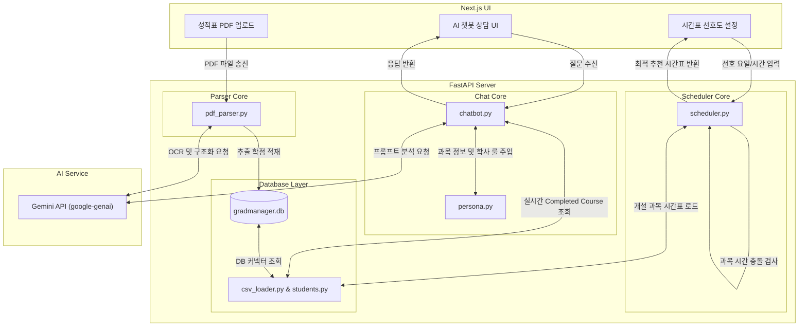

# 🎓 GradManager
> **졸업 관리 및 AI 챗봇 기반 수강 추천 시스템**  
> GradManager는 대학생의 졸업 요건 분석, 성적표 자동 파싱, 선호도 기반 시간표 자동 추천 및 AI 학사 안내 챗봇을 유기적으로 결합한 맞춤형 학사 지원 플랫폼입니다.

---

## 1. 프로젝트 소개
대학생들은 매 학기 수강신청 시점마다 복잡한 졸업 요건 충족 여부 계산과 강의 시간표 충돌 문제로 많은 곤란을 겪습니다. **GradManager**는 이러한 학생들의 불편을 해결하기 위해 개발되었습니다.

특히 **AI·SW계열(컴퓨터공학부, 소프트웨어융합학부, IT영상콘텐츠학과) 23학번 및 24학번 학생들**을 주요 타겟으로 정밀 조준하여 맞춤형 서비스를 제공합니다.

### 🌟 핵심 해결 과제 및 타겟 맞춤 기능
* **23·24학번 맞춤형 졸업 요건 분석**: 계열공통(36학점), 전공필수/선택 최소 이수 학점, 교양 이수한도(최소 35학점, 한도 45학점) 및 채플 이수 조건 등 복잡한 학번별 졸업 요건을 SQLite DB 데이터와 실시간 연동하여 자동 계산합니다.
* **성적표 PDF 구조화 파싱 (Gemini AI)**: 사용자가 PDF 성적표 파일을 업로드하면 Gemini AI가 수강 이력(과목코드, 과목명, 취득 학점, 성적, 재수강 여부)을 높은 정확도로 구조화하여 추출하고 데이터베이스에 자동으로 동기화합니다.
* **AI 챗봇 기반 1:1 학사 가이드**: 학생의 수강 이력 데이터를 인덱싱하여 "내가 더 들어야 하는 계공 과목이 뭐야?", "채플 몇 번 남았어?"와 같은 자연어 질문에 실시간 답변하고 미이수 필수 과목을 동적으로 제안합니다.
* **지능형 시간표 추천 엔진**: 요일/시간 선호 필터링, 피하고 싶은 시간대, 기수강 과목 자동 제외 및 과목 간 시간 충돌 방지 로직이 탑재된 알고리즘을 통해 학생 맞춤형 시간표 조합을 시뮬레이션 및 추천합니다.
* **학사일정 D-Day 및 공지사항 키워드 알림**: 크롤링된 SW중심대학 공지사항 데이터를 활용하여 학생들이 등록해 놓은 관심 키워드(예: 장학금, 공모전 등) 매칭 알림을 발송하며, 중요 학사일정의 마감 기한 트리거 경고를 띄웁니다.

---

## 2. 팀원 및 주요 역할 분담

우리 팀은 프론트엔드, 백엔드, 데이터 엔지니어링, AI 서비스 개발 영역으로 나누어 긴밀하게 협업하였습니다.

| 팀원 | 역할 | 주요 담당 업무 |
| :---: | :---: | :--- |
| **이예은** | **Frontend Developer** | • Next.js 기반 반응형 UI/UX 화면 개발 및 컴포넌트 설계<br>• 성적표 업로드 및 시각화 대시보드 구현, 시간표 조율 탭 개발 |
| **서현** | **Backend Developer** | • FastAPI 기반 RESTful API 설계 및 백엔드 서버 개발<br>• 학생 성적 입력, 졸업 조건 충족도 연산 로직 API 라우터 구현 |
| **우리** | **Data Engineer** | • MySQL / SQLite 관계형 데이터베이스 스키마(DDL) 설계<br>• 학교 개설 강의 목록 JSON 파싱 및 데이터 정제, SW공지 크롤링 파이프라인 구축 |
| **반재민** | **AI & Backend Lead** | • Gemini API 연동 AI 챗봇 가이드 로직, 프롬프트 엔지니어링 설계<br>• 키워드 및 학사일정 알림 기능 구현, 최종 리팩토링 및 폴더 구조 통합 총괄 |

---

## 3. 최종 폴더 구조 안내

프로젝트는 유지보수성과 확장성을 확보하기 위해 **백엔드(FastAPI)**, **프론트엔드(Next.js)**, **데이터베이스 스키마 및 마이그레이션 스크립트** 영역으로 명확히 통합 분리되어 있습니다.

```text
Grad-Manager/
├── backend/                    # [백엔드] FastAPI 어플리케이션
│   ├── app/                    # 웹 서버 구성 요소
│   │   ├── routers/            # API 라우터 (auth, graduation, chatbot, timetable 등)
│   │   ├── database.py         # SQLAlchemy DB 세션 의존성 정의
│   │   ├── models.py           # 데이터베이스 ORM 테이블 모델
│   │   ├── schemas.py          # Pydantic API 데이터 전송 스키마
│   │   ├── convert_db.py       # SQL 덤프 -> SQLite DB 실시간 동적 변환기
│   │   └── main.py             # FastAPI App 엔트리 포인트 (자동 DDL 마이그레이션 탑재)
│   ├── core/                   # 핵심 비즈니스 로직 모듈
│   │   ├── data/               # CSV 로더 및 인메모리 영속성 프록시 (courses, students 등)
│   │   ├── chatbot.py          # Gemini API 및 시스템 프롬프트 기반 챗봇 코어
│   │   ├── notifications.py    # 공지사항 키워드 매칭 및 학사 일정 트리거 엔진
│   │   ├── pdf_parser.py       # 성적표 PDF parsing 및 Gemini AI 구조화 추출기
│   │   ├── persona.py          # AI 챗봇 학습용 시스템 프롬프트 (학사 규정 마스터)
│   │   └── scheduler.py        # 시간표 생성 및 선호도 추천 시뮬레이터 알고리즘
│   ├── test_modules.py         # 백엔드 비즈니스 로직 통합 테스트 스크립트
│   ├── requirements.txt        # 백엔드 Python 패키지 의존성 파일
│   └── gradmanager.db          # 최종 구동 SQLite 데이터베이스 파일
│
├── database/                   # [데이터베이스] 관계형 DB 스키마 및 덤프
│   ├── gradmanager_schema.sql  # MySQL 기반 표준 DDL 스키마 정의서
│   └── gradmanager_dump.sql    # DML 초기 수강 정보 덤프 SQL 파일
│
├── data/                       # [데이터] 원본 소스 데이터 및 출력 결과 저장소
│   ├── input_data/             # 학사 강의 JSON, PDF 추출 커리큘럼, 26-2 전체 강의 CSV
│   └── output/                 # 정제 및 병합을 거쳐 추출된 최종 CSV 파일군
│
├── scripts/                    # [유틸리티] 데이터 정제 및 SQL 덤프 빌드 자동화 스크립트
│   ├── etl_generate.py         # XML 원본 강의 데이터 클렌징 및 통합 ETL 스크립트
│   ├── generate_data.py        # 데이터베이스 탑재용 초기 기초 데이터 매핑 스크립트
│   ├── generate_all_data.py    # JSON 과목 및 PDF 커리큘럼 병합 종합 CSV 생성 스크립트
│   ├── generate_dump.py        # 생성된 CSV 파일을 취합하여 하나의 .sql 덤프 구축
│   └── update_26_2_data.py     # 26학년도 2학기 데이터 업데이트를 위한 원클릭 마이그레이터
│
└── grad-manager-UI/            # [프론트엔드] Next.js 기반 UI 어플리케이션
```

---

## 4. 시작 가이드

프로젝트를 로컬 환경에 클론하고 구동하기 위한 가이드라인입니다.

### 4-1. 전제 조건 (Prerequisites)
* Python 3.10 이상
* Node.js v18 이상 및 npm
* 전역 패키지 관리자 `uv` (추천) 또는 `pip`

### 4-2. 백엔드 설치 및 구동 순서

1. **Python 가상환경 및 의존성 설치**:
   ```bash
   # 가상환경 생성 (uv 사용 권장)
   uv venv
   
   # 가상환경 활성화 (Windows)
   .venv\Scripts\activate
   
   # 라이브러리 일괄 설치
   uv pip install -r requirements.txt
   ```

2. **환경 변수 `.env` 설정**:
   최상위 폴더 및 `backend/` 폴더에 `.env` 파일을 생성하고 구글 Gemini API 키를 입력합니다.
   ```env
   GEMINI_API_KEY=your_google_gemini_api_key_here
   ```

3. **데이터 빌드 및 SQLite 마이그레이션**:
   정제된 학사 데이터를 구축하고 SQLite 데이터베이스에 인입하는 작업을 순차적으로 실행합니다.
   ```bash
   # 1. 원본 데이터 병합 CSV 생성
   python scripts/generate_all_data.py
   
   # 2. 데이터베이스 덤프 SQL 생성
   python scripts/generate_dump.py
   
   # 3. SQLite DB 파일 생성 및 최종 변환 마이그레이션 실행
   python backend/app/convert_db.py
   ```

4. **FastAPI 서버 구동**:
   ```bash
   # FastAPI 백엔드 서버 로컬 실행 (핫 리로드 활성화)
   uvicorn backend.app.main:app --reload --app-dir backend
   ```
   * 서버 구동 확인: 브라우저에서 `http://127.0.0.1:8000/` 접속 시 서버 정상 작동 메시지가 출력되면 성공입니다.
   * 대화형 API 문서: `http://127.0.0.1:8000/docs` 에서 실시간 API 테스팅이 가능합니다.

5. **백엔드 기능 검증 통합 테스트**:
   ```bash
   # 백엔드 코어 모듈 무결성 점검 (Windows)
   $env:PYTHONIOENCODING="utf-8"; .venv\Scripts\python.exe backend/test_modules.py
   ```

### 4-3. 프론트엔드 설치 및 구동 순서
```bash
# 프론트엔드 폴더 이동
cd grad-manager-UI

# NPM 의존성 패키지 설치
npm install

# Next.js 개발 서버 로컬 구동
npm run dev
```
* 브라우저에서 `http://localhost:3000` 으로 접속하여 UI 화면을 사용합니다.

---

## 5. 주요 기능별 아키텍처 요약



1. **PDF 성적표 구조화 추출**: `pdfplumber`로 PDF 바이너리 데이터를 텍스트로 전환한 후, Gemini API 모델을 활용하여 과목코드, 성적, 학점 등의 이수 내역을 안정적인 JSON 데이터 구조로 추출하여 DB에 보관합니다.
2. **AI 대화 안내 서비스**: SQLite 학생 이력 프록시와 연동하여 학생이 직접 들어야 하는 남은 학점을 계산합니다. Gemini API가 `persona.py` 에 정의된 엄격한 가이드라인 룰셋을 주입받아 학사 규정에 부합하는 챗봇 제안을 내보냅니다.
3. **선호도 매칭 시간표 시뮬레이션**: 학생의 기수강 이력을 배제한 채 개설 강의 시간 정보와 요일 필터, 선호 시간대, 피하고 싶은 시간대 등을 3차 필터 구조로 탐색하여 시간 충돌(Conflict)이 없는 실시간 시간표 포트폴리오를 제공합니다.
